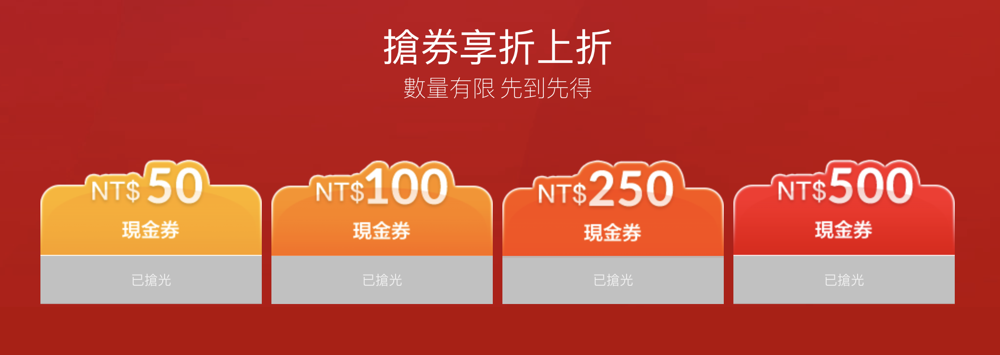

# 2018 雙 11 搶小米整點優惠券

## 版本

- Node
- Windows Console Application (C#)

## 目標網站與目標

> # [小米雙十一 超級購物節](https://event.mi.com/tw/sales2018/super-sales-day)

目標為 250 與 500 折價券
 

## 基本概念

> ## 於開賣時，發 request 打 250 與 500 的 API 直接取得。

Node 版本使用 `request` library 達到此目的。

C# 版本則直接使用原生的 `WebRequest` 達到此目的。

## API 需求

- Header 要有 `Referer` 與 `Cookie`
- 不要打對方打死 ...

## 最後

這篇 Git 就寫到這，如果看得懂的人，應該也不需要我多寫什麼了，也因此我把把這篇放到雙 11 後才發，如果說因為這個我們學到了什麼，大概就是做網站千萬不能只有簡單的驗證，否則自己的 Infra 會被打死，工程師修東西很辛苦的...。
